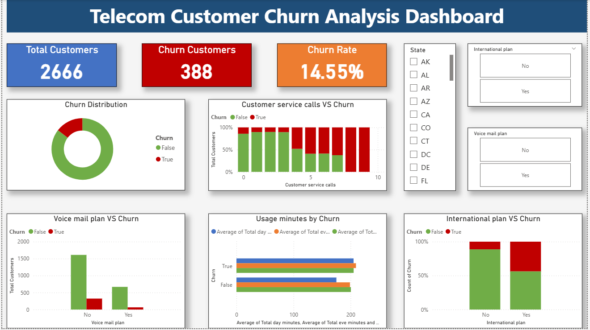
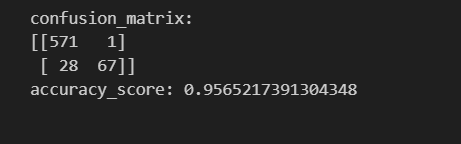

# Telecom Churn Analysis

## Table of Contents
- Project Overview
- Business Problem
- Dataset Information
- Tools & Technologies
- Data cleaning
- Exploratory Data Analysis
- SQL Business Analysis
- Power BI Dashboard
- Dashboard Preview
- Machine Learning Models
- Model Performance
- Key Insights
- Business Recommendations
- Future Importance
- Project Structure
- skills demonstrated

##  Project Overview

Customer churn is one of the biggest challenges faced by telecom companies. When customers leave a service, companies lose recurring revenue and must spend additional resources to acquire new customers.

This project analyzes telecom customer data to identify the key factors influencing customer churn and builds a machine learning model to predict whether a customer is likely to churn.

This project demonstrates an **end-to-end data analytics workflow**, including:

* Data Analysis using Excel

* Business Analysis using SQL

* Data Visualization using Power BI

* Machine Learning using Python

---

#  Business Problem

Telecom companies want to understand why customers discontinue their services.

The objectives of this project are:

* Identify patterns that lead to customer churn

* Analyze customer behavior and usage patterns

* Visualize churn insights using dashboards

* Build a machine learning model to predict churn risk

These insights help businesses implement strategies to retain customers.

---

#  Dataset Information

Dataset used: **Telecom Customer Churn Dataset**

The dataset contains telecom customer account information and usage details.

Key features include:

* State

* Account Length

* International Plan

* Voice Mail Plan

* Customer Service Calls

* Total Day Minutes

* Total Evening Minutes

* Total Night Minutes

* Churn (Target Variable)

Dataset files used in this project:

01_Data

• churn-bigml-20.csv

• churn-bigml-80.csv

---

#  Tools & Technologies Used

Excel → Exploratory Data Analysis

SQL → Business Data Analysis

Power BI → Data Visualization \& Dashboard

Python → Machine Learning Model

Scikit-Learn → Model Training

---

#  Data Cleaning

Before performing analysis, the dataset was validated and prepared.

Steps performed:

* Checked for missing values

* Verified categorical variables

* Reviewed column data types

* Ensured data consistency

The cleaned dataset was then used for further analysis.

---

#  Exploratory Data Analysis (Excel)

Exploratory Data Analysis (EDA) was performed using Excel pivot tables and charts.

Key analysis performed:

* Churn distribution

* Customer usage behavior

* Service call patterns

* Plan subscription analysis

Excel helped in identifying initial churn trends and relationships within the dataset.

Excel File Location:

02_Excel_EDA

Telecom_Churn_EDA.xlsx

---

#  SQL Business Analysis

SQL queries were written to analyze telecom customer behavior and churn patterns.

Key business questions answered:

* Total number of telecom customers

* Churn distribution

* Overall churn rate

* Customer service calls vs churn

* International plan vs churn

* Voice mail plan vs churn

* Usage minutes comparison

* Account length vs churn

SQL File Location:

03_SQL_Analysis

Telecom_Churn_Analysis.sql

---

#  Power BI Dashboard

An interactive Power BI dashboard was developed to visualize telecom churn insights.

Dashboard features include:

* Total Customers KPI

* Churn Customers KPI

* Churn Rate KPI

* Customer Service Calls vs Churn

* International Plan vs Churn

* Voice Mail Plan vs Churn

* Usage Minutes Analysis

Slicers were added to allow users to filter the dashboard dynamically.

Power BI File Location:

04_PowerBI_Dashboard

Telecom_churn_Analysis_DashBoard.pbix

---

#  Dashboard Preview

Below is the Power BI dashboard created for telecom churn analysis.

Image File Location:

06_Images/01_PowerBI_Dashboard.png

---

#  Machine Learning Model

A machine learning model was developed to predict whether a customer is likely to churn.

Steps performed:

* Data preprocessing

* Feature selection

* Train-test split

* Model training

* Model evaluation

Two models were used:

1. Logistic Regression (Baseline Model)

2. Random Forest (Final Model)

Random Forest produced better performance and was selected as the final prediction model.

Machine Learning File Location:

05_Machine_Learning

Telecom_Churn_ML_Analysis.ipynb

---

#  Model Performance

The Random Forest model was evaluated using a \*\*Confusion Matrix\*\*.

The confusion matrix helps evaluate the model by showing:

* True Positives

* True Negatives

* False Positives

* False Negatives

Confusion Matrix Image Location:

06_Images02_Random_Forest_Confusion_matrix.png

Model accuracy is also shown in the output of the confusion matrix.

---

## Key Insights

The analysis revealed several important insights:

* Customers with international plans show higher churn rates

* Customers making frequent customer service calls are more likely to churn

* Usage patterns influence churn probability

* Customers without voice mail plans tend to churn more frequently

These insights help telecom companies understand customer behavior better.

---

#  Business Recommendations

Based on the analysis, the following strategies can help reduce customer churn:

* Improve customer support services

* Monitor high-risk customers with international plans

* Provide loyalty benefits to long-term customers

* Offer personalized retention programs

Implementing these strategies can help telecom companies improve customer retention.

---

#  Future Improvements

This project can be extended further with the following improvements:

* Deploy the churn prediction model as a web application

* Implement real-time churn prediction

* Apply advanced machine learning models such as XGBoost

* Perform customer segmentation using clustering techniques

* Build automated data pipelines for continuous data updates

These improvements would make the system more scalable and production-ready.

---

#  Project Structure

Telecom-Churn-Analysis

README.md

01_Data

• churn-bigml-20.csv

• churn-bigml-80.csv

02_Excel_EDA

• Telecom_Churn_EDA.xlsx

03_SQL_Analysis

• Telecom_Churn_Analysis.sql

04_PowerBI_Dashboard

• Telecom_churn_Analysis_DashBoard.pbix

05_Machine_Learning

• Telecom_Churn_ML_Analysis.ipynb

06_Images

• 01_PowerBI_Dashboard.png

• 02_Random_Forest_confusion_matrix.png

---

#  Skills Demonstrated

* Data Cleaning

* Exploratory Data Analysis

* SQL Data Analysis

* Dashboard Development

* Machine Learning Modeling

* Business Insight Generation

---

# Author

Adilakshmi Vemala

Aspiring Data Analyst

Tools Used:

Excel | SQL | Power BI | Python | Machine Learning

